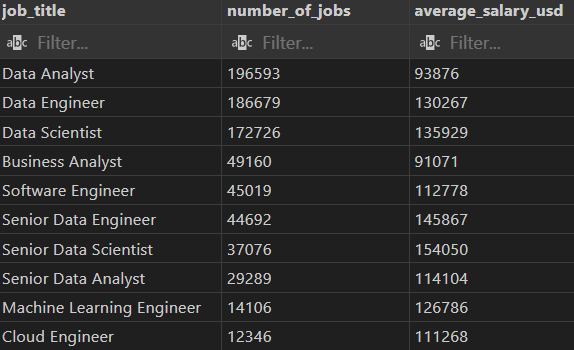
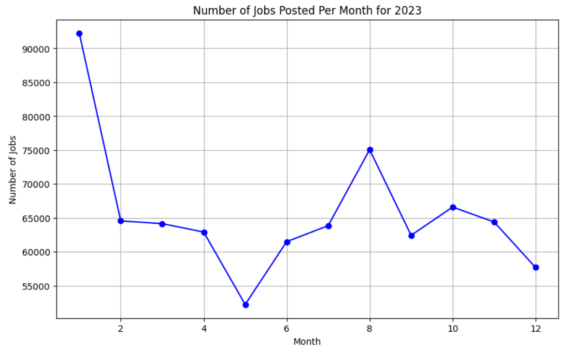
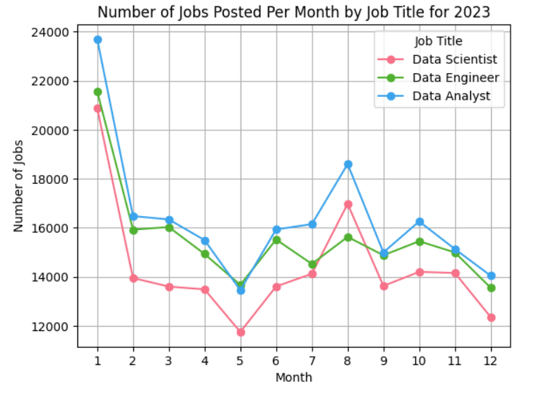
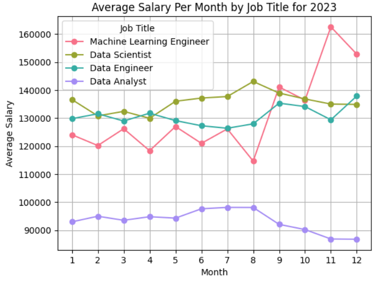

# About this project
The porpuse of this project is to look for insights regarding the Data job market and technology sectors. The dataset that will be used is a free dataset, provided by Luke Barousse (find the CSV files [here](https://drive.google.com/drive/folders/1moeWYoUtUklJO6NJdWo9OV8zWjRn0rjN)). The dataset is a collection of 787686 rows, that contains real information about job postings around the world, for 2023, such as job locations, salaries, skills required and more. 

# Tools used for the analysis
- SQL: The main tool that was used for this analysis in order to make queries.
- PostgreSQL (17.2): As the database managment system.
- VScode (1.98.1): As an integrated development environment (IDE).
- Git (2.47.0.windows.2) and Github: As a version control in order to share this project.
- Python (using Colab): In order to visualize some data.

# The Analysis
1. First query ([jobs_posted_vs_salaries.sql](/SQL_Project/jobs_posted_vs_salaries.sql)) of this project was in order to find how many job posting where made, in 2023, for each job category and how do their average yearly salaries compare. 

    

   *The results of this table indicate that the data job market offers the most job openings. However data analyst roles offer significantly lower average salaries, compared to data scientists and engineers, even though it is in the top of job postings.*

3. Next ([jobs_posted_per_month.sql](/SQL_Project/jobs_posted_per_month.sql)) thing to look into is the volume of job postings throughout 2023, for each month. 

    
   *This graph showcases a descending trend in the job offering volume from the start of the year to its end.*

    In order to confirm this trend it would be usefull to look into how the top 3 job roles postings change throughout the months.

    

   *This graph confirms the general trend as each job title relatively follows the observed trend.*

5. For the next part ([avg_salaries_per_month.sql](/SQL_Project/avg_salaries_per_month.sql)), it would be intersting to check if there is a trend in the average salary that is offered regarding the month of the job posting. More specifically a comparison between the top 3 roles and machine learning engineers is interesting, as the second is a relatively more recent job market.

    

   *In this graph the top 3 data jobs keep, pretty much, a steady average salary througout the 2023. However the machine learning engineers are being offered a significant higher salary as the year comes to its end.*

    This result is somewhat expected, as it is well known that in recent years Machine learning (ML) and AI have advanced significantly and the need for more ML and AI specialists is constantly increasing. So is the budget that is spent in this sector. 
    (It would be interesting to have more data to look if this trend continued in 2024!)

7. Moving on, this query ([junior_jobs_vs_salaries.sql](/SQL_Project/junior_jobs_vs_salaries.sql)) will bring the table which provides the number of junior level jobs that are being offerd in each job category and their average yearly salaries.

    

   *The table shows that the top 3 job categories for junior level job postings are still the three roles in the data sector. It also shows that the average salaries for these roles are lower compared to highter level ones, as it is expected.*

9. The analysis up to this point showcases that the data job market is the best choice for someone, in terms of job opportunities. So it is important to bring out the top skills that employees are looking for. Here ([top_data_skills.sql](/SQL_Project/top_data_skills.sql)) the two queries provide the top five skills for data roles in general and the top five skills for junior level data roles in order to compare.

    

   *Top 5 data job market skills.*

    

   *Top 5 junior level data job market skills.*

    The results from the two tables, showcase the importance for a candidate to have knowledge of SQL and Python. Including excel (which appears in both tables) these are the main tools in order to manipulate data, so their importance is expected for these roles. Close to them, data visualization tools are really valued by the market.

11. One more interesting subject to dive into are the remote opportunities that are being offered. Here ([remote_to_all_jobs_percentage.sql](/SQL_Project/remote_to_all_jobs_percentage.sql)) is being provided the percentage of remote job to all job postings, per month.

    

    *Combined with the expectations at the post covid era, this graph gives a strong indication that the remote job offers are increasing.*

13. To complete this analysis, this query ([top_data_skills_remote.sql](/SQL_Project/top_data_skills_remote.sql)) provides the top five skills that are required for remote job offers, for the top three data roles. 

    

    *Compared to the top 5 skills that are required in general, as shown previously, what remains constant is the importance of SQL and Python.*
